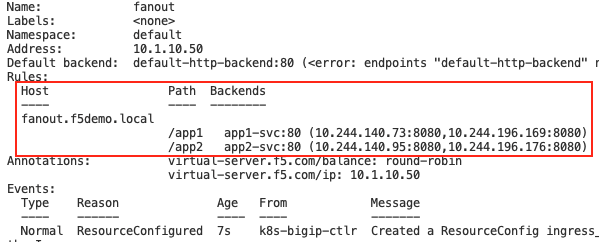
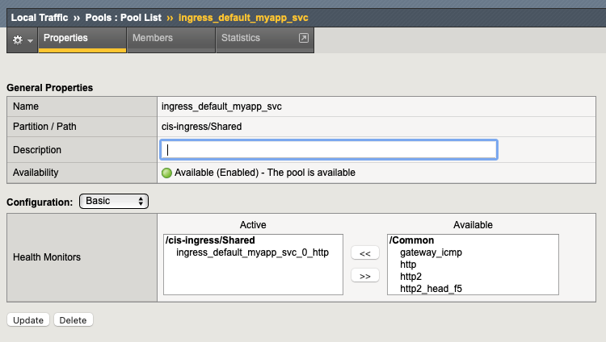

# Ingress Examples

In this section we provide examples for the most common use-cases of Ingress Resources with F5 CIS

- [Basic-Ingress](#Basic-Ingress)
- [FQDN-Based-Routing](#FQDN-Based-Routing)
- [FanOut/Path-Based-Routing](#FanOut/Path-Based-Routing)
- [Use-cases](#use-cases)
- [Variables](#variables)

Before starting with the examples below, please make sure of the following:

-- Apps are running on the default namespace. --
```
kubectl apply -f basic-ingress.yml
```

-- CIS is running --

## Basic-Ingress
The following example deploys a basic ingress resource for a single K8s service.

Create the Ingress resource.
```
kubectl apply -f basic-ingress.yml
```

Confirm that the Ingress works:
```
kubectl describe ing basic-ingress
```

You should see the following output. Notice that the value of Host and Path (marked in red) is configured as `*`. 


Access the service with the use of curl as per the examples below. 

```
curl http://10.1.10.40 
curl http://10.1.10.40/test.php
curl http://test.f5demo.local --resolve test.f5demo.local:80:10.1.10.40
```

In all three cases you should see similar output:


## FQDN-Based-Routing
The following example deploys an Ingress resource that routes based on FQDNs:
fqdn1.f5demo.local => app1-svc
fqdn2.f5demo.local => app2-svc

Create the Ingress resource
```
kubectl apply -f fqdn-based-routing.yml
```

Confirm that the Ingress works:
```
kubectl describe ing fqdn-based-routing
```

You should see the following output. Notice that the value of Host is now defined ("fqdn1.f5demo.local" / "fqdn2.f5demo.local").


Try accessing the service with the use of curl on the IP address assigned for the ingress. 
```
curl http://10.1.10.14
```

You should see a reset connection as it didnt match the configured Host Header.

Try again with either of the 2 following options

```
curl http://fqdn1.f5demo.local/ --resolve fqdn1.f5demo.local:80:10.1.10.50
curl http://fqdn2.f5demo.local/ --resolve fqdn2.f5demo.local:80:10.1.10.50
```

In both cases you should see that similar output but from different backend pods (app1 and app2 pods):


## FanOut/Path-Based-Routing
The following example deploys an Ingress resource that routes based on URL Path:
fanout.f5demo.local/__app2__ => app2-svc
fanout.f5demo.local/__app1__ => app1-svc

Create the Ingress resource
```
kubectl apply -f fanout.yml
```

Confirm that the Ingress works:
```
kubectl describe ing fanout
```

Notice on the output that the value of Host is now defined "fanout.f5demo.local" and on the Path level there are 2 entries; __app1__ that points to `app1-svc` and __/app2__ that points to `app2-svc`.



Try accessing the service on a path that has not been defined on the Ingress resource.

```
curl http://fanout.f5demo.local/test/index.php --resolve fanout.f5demo.local:80:10.1.10.50
```
You should see a reset connection as it didnt match the configured Path value.

Try again with either of the following options
```
curl http://fanout.f5demo.local/app1/index.php --resolve fanout.f5demo.local:80:10.1.10.50
curl http://fanout.f5demo.local/app2/index.php --resolve fanout.f5demo.local:80:10.1.10.50
curl http://fanout.f5demo.local/app1 --resolve fanout.f5demo.local:80:10.1.10.50
curl http://fanout.f5demo.local/app2 --resolve fanout.f5demo.local:80:10.1.10.50
```

In all cases you should see similar outputs but from different backend pods (__app1__ and __app2__ pods) depending on the path.


## Health Monitors
The following example deploys an Ingress resource with health monitor to verify that the K8S service is working properly.

__"HTTP GET /health/echo" => health-monitor-1__

Create the Ingress resource
```
kubectl apply -f health-monitor.yml
```

Confirm that the Ingress works:
```
kubectl describe ing health-monitor
```

You should see the following output. Notice on the annotation section the health monitors have been defined.


On the BIGIP UI, you should see the application pool marked as green and a custom monitor assinged to the pool

| BIGIP Pool             |  Pool Details |
:-------------------------:|:-------------------------:
  |  


## AppRoot Rewrite
The following example deploys an Ingress resource with rewrite-app-root annotation that will redirect any traffic for the root path `/` to `/approot1`

__http://rewrite1.f5demo.local/ => http://rewrite1.f5demo.local/approot1__

Create the Ingress resource
```
kubectl apply -f rewrite-app-root.yml
```

Try accessing the service with the use of curl as per the examples below

```
curl -v http://rewrite1.f5demo.local/ --resolve rewrite1.f5demo.local:80:10.1.10.50
curl -v http://rewrite2.f5demo.local/ --resolve rewrite2.f5demo.local:80:10.1.10.50
```

You should see that the path that was send on the backend application has been changed from `/` to `/approot1`.
Similarly if accessing the service `rewrite2.f5demo.local` the path will change to `approot2`


## URL Rewrite
The following example deploys an Ingress resource that rewrites the URL from `lab.f5demo.local/mylab` to `laboratory.f5demo.local/mylaboratory`

Create the Ingress resource
```
kubectl apply -f url-rewrite-ingress.yml
```

Try accessing the service with the use of curl as the example below

```
curl http://lab.f5demo.local/mylab --resolve lab.f5demo.local:80:10.1.10.50
```

You should see that the Hostname and Path that was send on the backend application has been changed as per the Ingress resource configuration.


## TLS Ingress (certificate on K8s)
The following example deploys a TLS ingress resource that has the certificate stored on K8s as a secret.

Deploy the secret on Kubernetes that holds the certificate
```
kubectl apply -f apps-tls-secret.yml
```

Create the Ingress resource
```
kubectl apply -f tls-cert-k8s.yml
```

Try accessing the service with the use of curl as per the example below. We use curl's -k option to turn off certificate verification and the -v option to get the TLS certificate details
```
curl -vk https://tls-k8s.f5demo.local --resolve tls-k8s.f5demo.local:443:10.1.10.51
```

You should see the following output. Please notice the `CN` value configured on the certificate


Also verify on BIGIP that a new certificate has been created under `cis-ingress` partition


## TLS Ingress (certificate on BIGIP)
The following example deploys a TLS ingress resource that has the certificate stored on BIGIP as a SSL Client Profile.

Verify that the SSL Client Profile exists (see below)


Create the Ingress resource
```
kubectl apply -f tls-cert-bigip.yml
```

Try accessing the service with the use of curl as the example below

```
curl -vk https://tls1.f5demo.local --resolve tls1.f5demo.local:443:10.1.10.52
```

You should see the following output. Please notice the `CN` value configured on the certificate. We use curl's -k option to turn off certificate verification and the -v option to get the TLS certificate details


## TLS Ingress (certificate on BIGIP)
The following example deploys an ingress resource with 2 FQDNs that require different TLS certificates (stored on BIGIP).

Verify that both SSL Client Profile exists (see below). 


One of the certificates (in this case tls1) has to be the SNI default profile. Please select the tls1 profile and verify the configuration (marked in RED)


Create the ingress resource
```
kubectl apply -f multi-tls-cert-bigip.yml
```

Try accessing both services with the use of curl as per the examples below. We use curl's -k option to turn off certificate verification and the -v option to get the TLS certificate details

```
curl -vk https://tls1.f5demo.local --resolve tls1.f5demo.local:443:10.1.10.53
curl -vk https://tls2.f5demo.local --resolve tls2.f5demo.local:443:10.1.10.53
```

You should see the following output. Notice that the `CN` value change based on the FQDN as a different certificate gets presented to the client.


