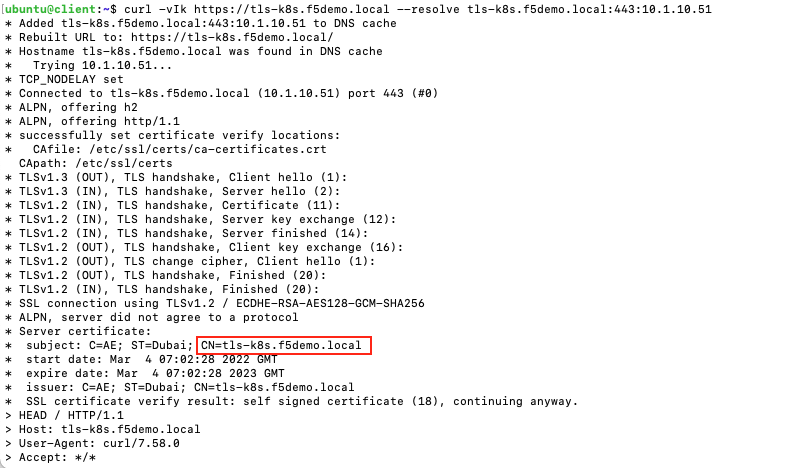
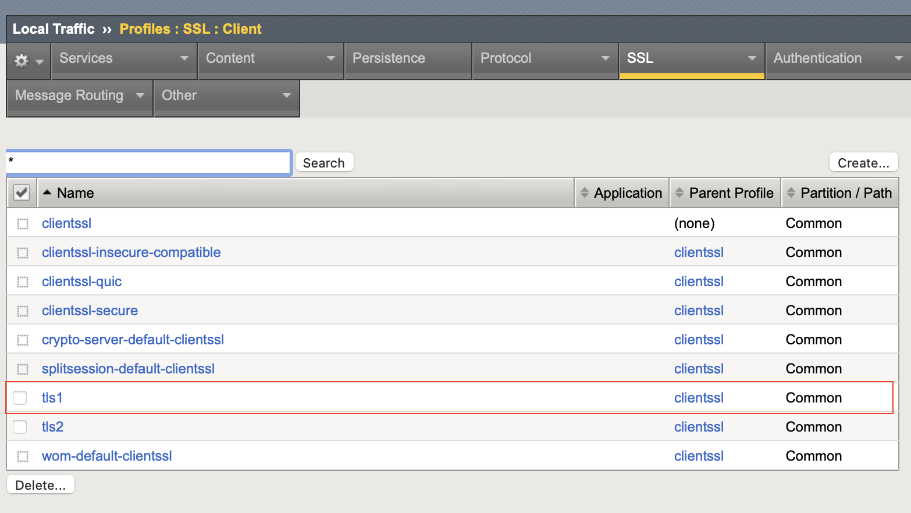
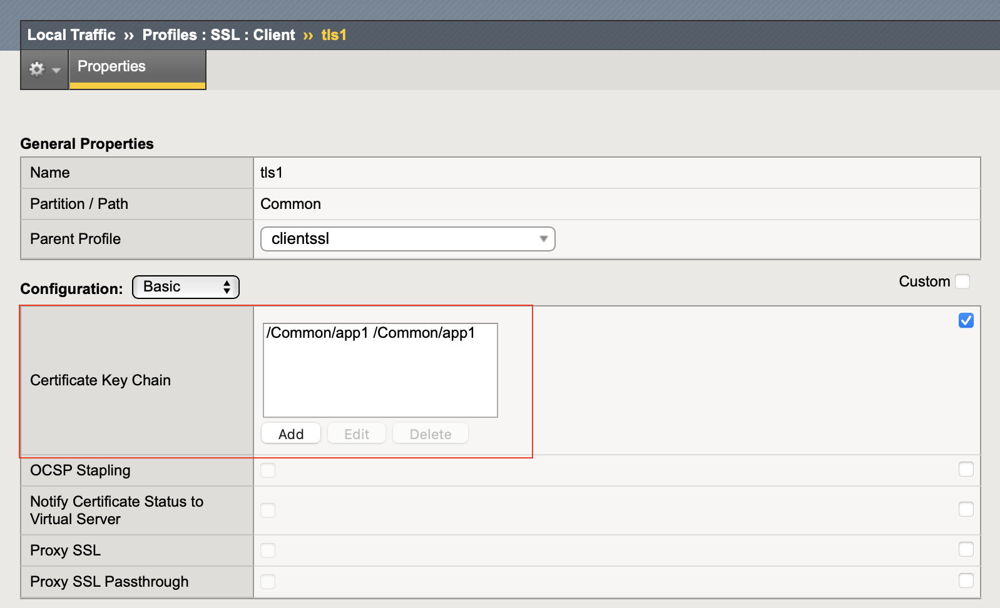
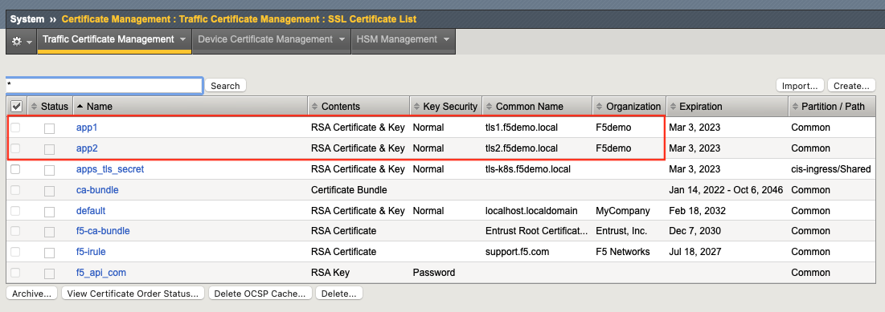

# Ingress Examples

In this section we provide 3 TLS examples


- [TLS Ingress (certificate on K8s)](#tls-ingress-certificate-on-k8s)
- [TLS Ingress (certificate on BIGIP)](#tls-ingress-certificate-on-bigip)
- [Multi-TLS Ingress (certificate on BIGIP)](#multi-tls-ingress-certificate-on-bigip)

## TLS Ingress (certificate on K8s)
In the following example we deploy a TLS ingress resource that has the certificate stored on K8s as a secret.

Deploy the secret on Kubernetes that holds the certificate
```
kubectl apply -f apps-tls-secret.yml
```

Create the Ingress resource
```
kubectl apply -f tls-cert-k8s.yml
```

Try accessing the service with the use of curl as per the example below. We use curl's -k option to turn off certificate verification and the -v option to get the TLS certificate details
```
curl -vk https://tls-k8s.f5demo.local --resolve tls-k8s.f5demo.local:443:10.1.10.51
```

You should see the following output. Please notice the `CN` value configured on the certificate



Verify that on BIGIP a new certificate has been created under `cis-ingress` partition


## TLS Ingress (certificate on BIGIP)
In the following example we deploy a TLS Ingress resource that has the certificate stored on BIGIP as a SSL Client Profile.

Verify that the certificate exists (see below)


Verify that the SSL Client Profile exists and is assigned the above certificate (see below)

| SSL Profile             |  Profile Details |
:-------------------------:|:-------------------------:
 |  

Create the Ingress resource.
```
kubectl apply -f tls-cert-bigip.yml
```

Try accessing the service.

```
curl -vk https://tls1.f5demo.local --resolve tls1.f5demo.local:443:10.1.10.52
```

You should see the following output. Please notice the `CN` value configured on the certificate. We use curl's -k option to turn off certificate verification and the -v option to get the TLS certificate details


## Multi-TLS Ingress (certificate on BIGIP)
In the following example we deploy an Ingress resource with 2 FQDNs that require different TLS certificates (stored on BIGIP).

Verify that both certificates exists (see below)



Verify that the SSL Client Profile exists for both certificates


One of the certificates (in this case tls1) has to be the SNI default profile. Please select the tls1 profile and verify the configuration (marked in RED)


Create the ingress resource
```
kubectl apply -f multi-tls-cert-bigip.yml
```

Try accessing both services as per the examples below. We use curl's -k option to turn off certificate verification and the -v option to get the TLS certificate details

```
curl -vk https://tls1.f5demo.local --resolve tls1.f5demo.local:443:10.1.10.53
curl -vk https://tls2.f5demo.local --resolve tls2.f5demo.local:443:10.1.10.53
```

You should see the following output. Notice that the `CN` value change based on the FQDN as a different certificate gets presented to the client.


